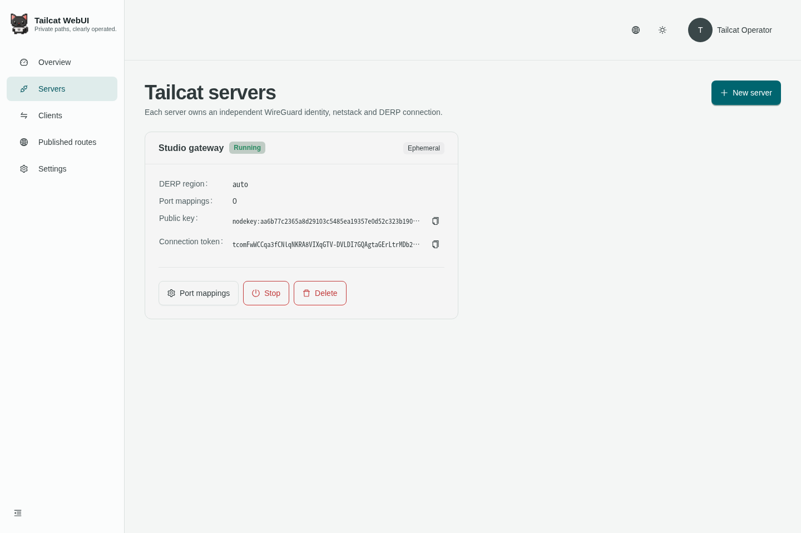
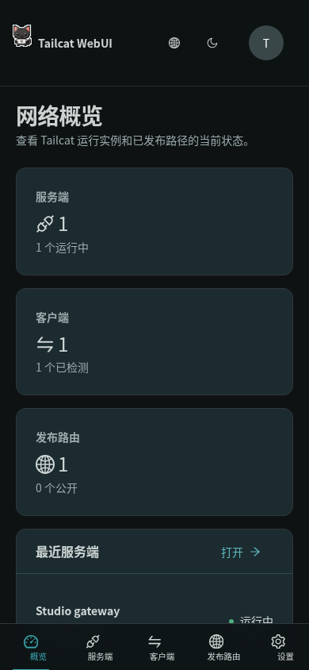

<p align="center">
  
</p>

<h1 align="center">Tailcat WebUI</h1>

<p align="center">支持多用户、多实例和移动端的 Tailcat 控制台。</p>

<p align="center"><a href="README.md">English</a> · <a href="docs/openapi.yaml">OpenAPI</a></p>

Tailcat WebUI 将 [Tailcat](https://github.com/tailscale/tailcat) 封装成长期运行、
使用 OIDC 登录的 Web 应用。每位用户都可以创建多个相互独立的 Tailcat 服务端和
客户端，并通过稳定的子路径发布远端 HTTP、SSE 和 WebSocket 资源。

## 实际项目截图

### 桌面端浅色主题 · 服务端管理



### 移动端深色主题 · 中文网络概览

<p align="center">
  
</p>

以上截图均由实际运行的内嵌应用生成，不是设计稿。

## 功能

- 同一进程、同一用户均可运行多个独立服务端和多个客户端。
- 临时身份、加密保存的稳定身份、客户端公钥白名单。
- TCP 端口转发、免认证 SSH 服务端、受目标网段策略限制的出口节点。
- Ping、直连/DERP/Peer Relay 路径判断、令牌解析和完整令牌解析。
- DNS `tailcat=tc…` TXT 记录、自定义 DERP 主机或 DERP Map。
- 认证 WebSocket TCP 隧道，对应 netcat 管道和 SOCKS 任意 TCP 访问场景。
- `/r/{slug}/*` 发布 HTTP、SSE 与 WebSocket，可选择仅本人或公开访问。
- OIDC 授权码流程、PKCE、nonce、state、服务端会话和多用户数据隔离。
- React 19 + Ant Design 6；所有表单、抽屉、弹窗、确认和反馈均使用框架组件。
- 简体中文/英文；浅色、深色、跟随系统三种外观。
- Go 1.27、Ent、默认纯 Go SQLite，无 CGO 单文件部署。

## 快速开始

需要 Go 1.27.0、Node.js 26 和 pnpm 11.3。

```sh
git clone https://github.com/ca-x/tailcat-webui.git
cd tailcat-webui
cd web && pnpm install --frozen-lockfile --ignore-scripts && cd ..
make build
```

在 OIDC 服务中配置回调地址：

```text
https://tailcat.example.com/api/v1/auth/callback
```

```sh
export TAILCAT_WEBUI_ADDR=:8080
export TAILCAT_WEBUI_BASE_URL=https://tailcat.example.com
export TAILCAT_WEBUI_PUBLISH_BASE_URL=https://publish.tailcat.example.com
export TAILCAT_WEBUI_DATA_DIR=./data
export TAILCAT_WEBUI_MASTER_KEY="$(openssl rand -base64 32)"
export TAILCAT_WEBUI_OIDC_ISSUER=https://id.example.com
export TAILCAT_WEBUI_OIDC_CLIENT_ID=tailcat-webui
export TAILCAT_WEBUI_OIDC_CLIENT_SECRET=replace-me
./bin/tailcat-webui
```

`TAILCAT_WEBUI_MASTER_KEY` 必须长期保持不变；它用于加密远端连接令牌和已保存的
Tailcat 私钥，丢失后无法恢复这些记录。

仅在本机试用时可启用演示模式：

```sh
TAILCAT_WEBUI_DEMO_MODE=true make dev
```

演示模式会拒绝非回环地址，不能用于线上部署。

## Docker

```sh
docker run --rm -p 8080:8080 \
  -v tailcat-data:/data \
  -e TAILCAT_WEBUI_BASE_URL=https://tailcat.example.com \
  -e TAILCAT_WEBUI_PUBLISH_BASE_URL=https://publish.tailcat.example.com \
  -e TAILCAT_WEBUI_MASTER_KEY="$TAILCAT_WEBUI_MASTER_KEY" \
  -e TAILCAT_WEBUI_OIDC_ISSUER=https://id.example.com \
  -e TAILCAT_WEBUI_OIDC_CLIENT_ID=tailcat-webui \
  -e TAILCAT_WEBUI_OIDC_CLIENT_SECRET="$OIDC_CLIENT_SECRET" \
  ghcr.io/ca-x/tailcat-webui:latest
```

建议由可信反向代理终止 TLS，并保持 `TAILCAT_WEBUI_BASE_URL` 为 HTTPS，应用
会据此启用 Secure Cookie 和 HSTS。发布域名需要配置通配 DNS/TLS（例如
`*.publish.tailcat.example.com`）；每条路由使用独立子域名，隔离不同租户的脚本和 Cookie。

## 开发验证

```sh
make generate
make lint
make test
make build
make verify
```

SQLite 默认启用外键、WAL、`synchronous=NORMAL`、5 秒 busy timeout、mmap 和
有界连接池。出于 WAL 并发读性能考虑，不启用 shared-cache。

安全设计见 [docs/security.md](docs/security.md)。Tailcat 本身不承诺 Go API、CLI
或线协议稳定性，因此项目固定上游 revision，并把直接依赖隔离在
`internal/tailnet`。

## 许可证与上游说明

Tailcat WebUI 使用 AGPL-3.0-only。Tailcat 及其猫图标由 Tailscale Inc. 与贡献者
以 BSD-3-Clause 发布，详见 [NOTICE.md](NOTICE.md)。本项目是独立社区项目，未获
Tailscale Inc. 背书。
